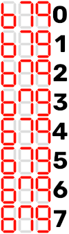
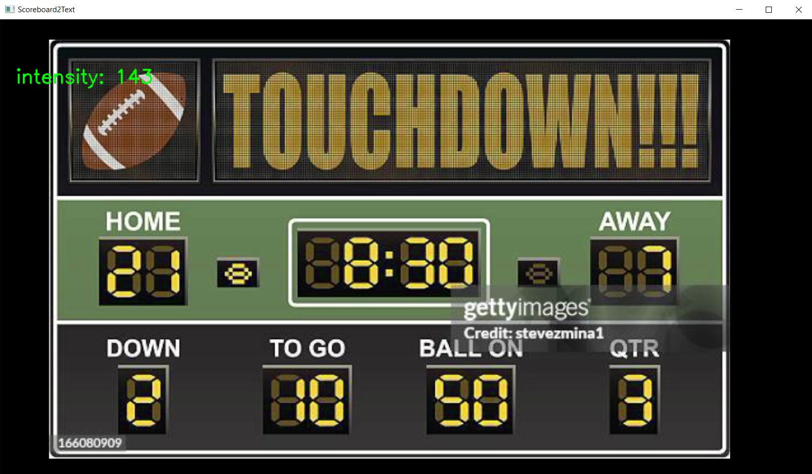
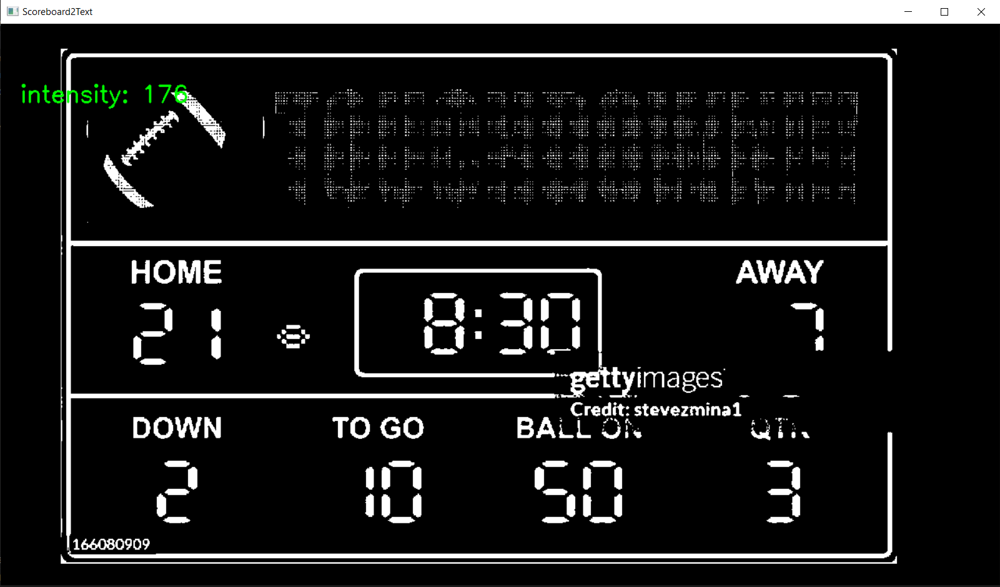
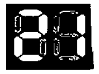
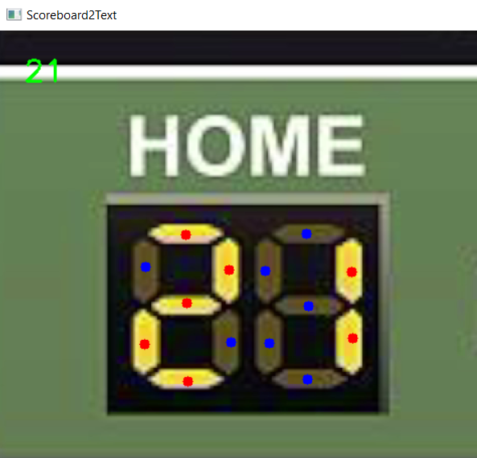

# Scoreboard2Text

## A simple and sort of usable way of converting a video of a 7 segment scoreboard into digital files for OBS

# Step 1. Installation

First step of the installation is to get python installed, if you already have python3 installed, skip this step.
To install python, go to this link and download python via the download button: https://www.python.org/downloads/

> ### Note: On some operating systems, make sure to click the standalone installer link instead of Python install manager link for a quick install.

After downloading, go through the installation of python, after this, Python 3 should be installed and ready to use.

Next you need to download the repository to use the program. To do this, go to the home page of this repository (https://github.com/Arzejames/scoreboardToText), the click the green code button, and then click the "Download ZIP" button.

After downloading the repository, unzip the file into its own file so all of its contents can be together. Now you are ready for the next step.

# Step 2. Using the command line and installing packages

Now we have gotten python installed and the repository downloaded, we can learn to use the command line to use the program and to install some required addons for the program.

## Windows Tutorial

To open the command line on Windows, go to the search bar and search "command prompt" or "cmd" and hit enter to open the command line.

Now open explorer and go to the folder where you have extracted the program, then click at the top where it should say something along the lines of **Downloads > scoreboardToText,** click on this and copy that path.

Then go back to the command line, where you will type the following and then paste that directory via right clicking, after that, hit enter to run the commmand.

```
cd (insert pasted directory)
```

```
Example: cd C:\Users\User\Downloads\scoreboardToText
```

Now we are in the right directory, we need to install the needed packages via the `requirements.txt` file. To do this type the following command below in your command line and then hit enter to run it.

```
pip3 install -r requirements.txt
```

After running, you will need to wait a little bit for the packages to install, when it is finished, you can contiue to the next step.

## Mac Tutorial

To open the command line on Mac, go to your applications folder and open the "Utilities" folder, there, open the program "Terminal" to open the command line.

Now we need to get into the right directory to install the needed packages for the program, to do this, we need to figure out what folder and subfolder our file is in, you can look in finder for this, but in most cases, its in the downloads folder with the name `scoreboardToText-main`.

To enter this in the command line, enter the following command:

```
cd Downloads/scoreboardToText-main/
```

> ### Note: You might need to change either the `Downloads` or the `scoreboardToText-main` part of the command to enter the folder.

Now we are in the right directory, we need to install the needed packages via the `requirements.txt` file. To do this type the following command below in your command line and then hit enter to run it.

```
pip3 install -r requirements.txt
```

> ### Note: When you do this, you may get a popup saying "The "git" command requires the command line developer tools...", click the install button on this popup so the packages can install properly.

After running, you will need to wait a little bit for the packages to install, when it is finished, you can contiue to the next step.

# Step 3. Running the program

Now we have gotten python installed and the packages updated, we can now finally use the program. To open the program use the following command in your command line:

```
python3 scoreboard2text.py
```

Now it will list all your currently connected cameras, if your camera does not pop up here, you can use either the `Ctrl+C` shortcut or the `Ctrl+D` shortcut to close the program. After that, relaunch the program.

To select a camera from this list, type the number in the parentheis and then hit the enter key. For example:

```
What camera would you like to use?
Streamlabs Desktop Virtual Webcam:700 - (0)
OBS Virtual Camera:701 - (1)
EOS Webcam Utility Pro:702 - (2)
Camera to use:
```

If I wanted to use the "OBS Virtual Camera", I would type the number 1 and then hit enter.

```
Camera to use:1
```

> ### Note: If you get an error such as `ERROR: Cannot connect to camera`, there might be an issue with your camera. Try restarting the program or your camera to try to fix this issue.

Now we get the question about the font your scoreboard uses. Some scoreboard have different ways of displaying the numbers 6, 7, and 9, so we need to enter what font our scoreboard uses. Most scoreboards use the 4th font, but you can double check by checking the image below.



To select your font, do the same thing as you did for the camera selection and type the font number and then hit enter.

```
Font to use (Check scoreboardFontSelector.png for number) 4 normaly:4
```

Now you should have a window open that shows the live camera feed

# Step 4. Using the program

Now you have gotten the programing running, you can learn how to use the program. First thing to learn is the keys you need to know to use the program.

|  Key   | Use                                              |
| :----: | :----------------------------------------------- |
|  `q`   | Used to quit the program                         |
|  `u`   | Used to undo placed trackers                     |
|  `c`   | Used to change picutre in either color or B/W    |
|  `i`   | Used to decrease B/W intestity                   |
|  `o`   | Used to increase B/W intestity                   |
| `wasd` | Used to move all trackers (Used like arrow keys) |

Now you have learned these keys, lets jump into the program.

## Getting camera set up

To get the camera positioned properly, point it at the scoreboard and zoom in until the scoreboard takes up almost the entire frame, like the simulated one below.



After that, press the `c` key to switch the view to B/W Colors like in the screenshot below.



In this mode, you can see the camera view in the B/W mode, which is used by the program to see if a number segment in one or off.

In most cases, the default intensity will not differentiate the number segments when they are on or off properly, so you will need to increase or decrease the intensity with the `i` and `o` keys so the program will work properly.  

Look at the images below to know how to set your intensity properly.

|Too Low|Good|Too High|
| :----: | :--: | :-: |
|     |  |  |

## Selecting the number segments

Now its time to select the segments so we can digitalize the scoreboard.

To select the numbers, go to the number you want to digitalize and click on each segment of the number in the order below from A to G. Make sure that when you are placing, you do not place the points on the edges of the numbers.


>### Note: You can press the `c` to change the video color back to color if you need to place points on segments that are off.

>### Note: If you make a mistake when you are entering the points, you can press the `u` key to undo that placement.

If you did this correctly, you should see the number you entered at the top-left corner of the screen like in the image below.



# Step 5. Adding to OBS

Now we have the score being digitalized, we need to add it to OBS.

To do this, add a new text element in OBS and then go into the properties of the element. In here, you need to click on the button that says "read from file". This will open a file selector window.

This program seperates each number into its own text file, so you will need to select each file in this programs directory in that file selectory window.

Once you finish this, you should have the text in OBS refreshing.

>### Q: What happens if my camera gets bumped and the circles get unaligned?
>### A: If your circles get unaligned, you might need to redo the selection process, but you might be able to realign them using the `wasd` keys as arrow keys to try to realign them.